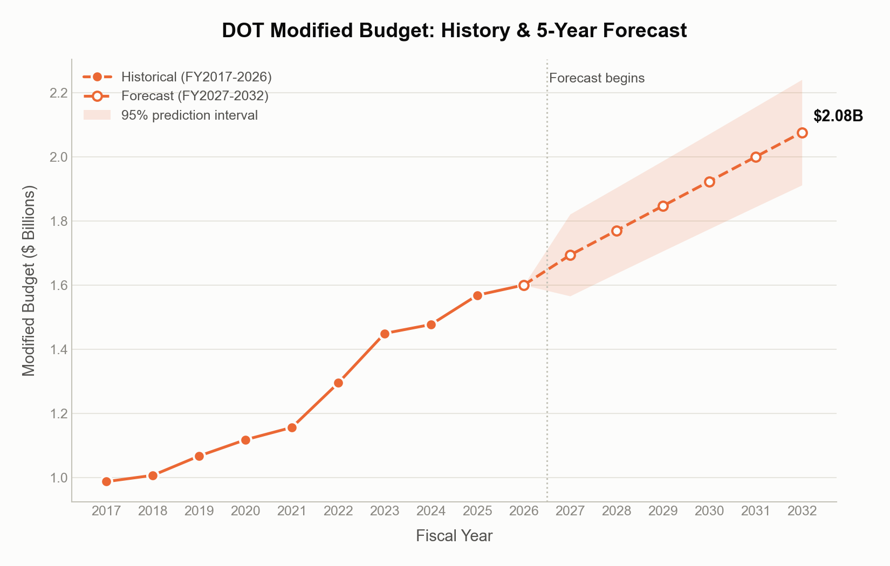
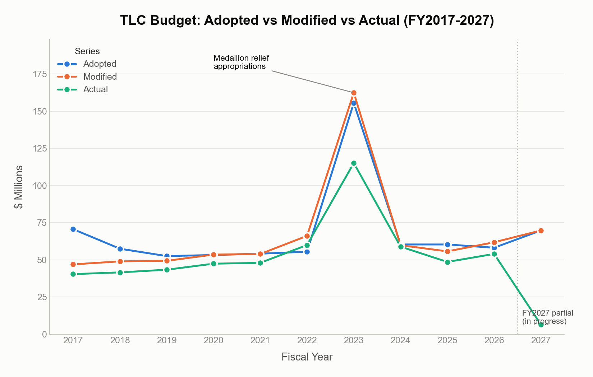
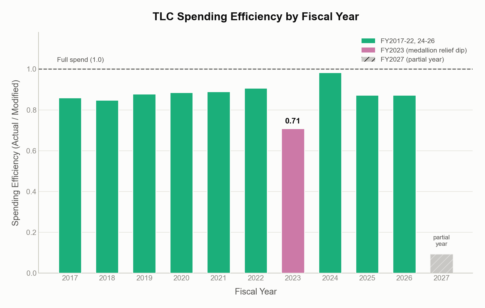
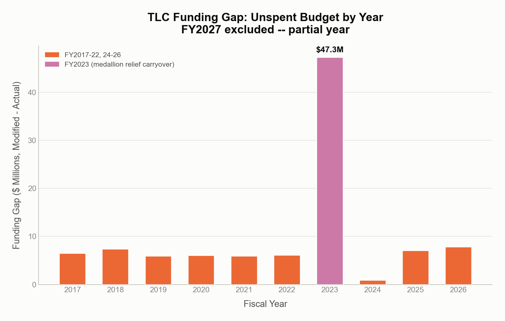

# NYC Budget Allocation Capstone: Planned vs. Actual Spending

This project analyzes how two NYC agencies — the **Department of
Transportation (DOT)** and the **Taxi and Limousine Commission (TLC)** —
manage their budgets over FY2017-FY2027. For each agency, adopted budget,
modified budget, and actual expenditures are reconciled year by year to
measure spending efficiency, surface funding gaps, and build honest
trend-based forecasts of future funding needs. The two agencies turn out to
behave very differently, and that difference is the core finding of this
work.

---

## Key Findings

**DOT**
- Spending efficiency (actual ÷ modified budget) holds steady at
  **0.83–0.93** across FY2017-2026 — DOT reliably spends most of what it's
  allocated, every year.
- A simple linear trend forecast, fit on FY2017-2026 alone, predicted
  FY2027's Adopted budget within **2.18% error** — validated against the
  real FY2027 figure, which was held out of training.
- Extending that trend, DOT's projected cumulative Modified-budget need for
  **FY2028-2032 is ~\$9.6B** (point estimate; 95% range ~\$8.9B–\$10.4B).

**TLC**
- Spending efficiency holds at **0.85–0.98** across FY2017-2026 (excluding
  the anomaly below) — comparably disciplined to DOT, just at a much
  smaller budget scale (~\$50-70M/year vs. DOT's ~\$1-1.6B/year).
- **FY2023 is a documented anomaly**, not a data error: efficiency dropped
  to 0.71 because two one-time medallion-relief appropriations (`MLG2`
  Medallion Loan Guarantee + `CR02` Medallion Relief Fund, \$50M each, tied
  to the NYC taxi medallion debt crisis) were budgeted in full but
  disbursed over multiple years.

---

## Trends

**DOT — Modified budget, history + forecast**

Ten years of DOT's Modified budget (FY2017-2026) with the linear trend
projected forward and its 95% prediction interval shaded. The steady
upward slope, with no single year dominating the fit, is what makes DOT's
forecast trustworthy.

**TLC — Adopted vs. Modified vs. Actual**

The same three-series comparison for TLC. FY2023's medallion-relief spike
is clearly visible as a one-year departure from an otherwise flat
~\$50-65M budget band, not a gradual trend.

**TLC — Spending efficiency by year**

Actual spending as a share of Modified budget, year by year. Every year
lands in a believable 0.85-0.98 band except FY2023, which is the visual
signature of the medallion-relief carryover explained above.

**TLC — Funding gap by year**

Modified budget minus Actual spending, in dollars. FY2023's unspent
balance is far larger than any other year's in raw terms — the same
anomaly, seen from the dollar-gap side rather than the ratio side.

---

## Budget Behavior Archetypes

The two agencies illustrate two different archetypes of municipal budget
behavior:

- **DOT is predictable.** Large, stable, multi-year infrastructure and
  operations spending that moves in a smooth, low-noise trend. A simple
  linear model captures it well (R² in the 0.8-0.9+ range depending on the
  series), and the FY2027 out-of-sample check confirms the trend holds in
  practice.
- **TLC is shock-driven.** Small, efficiently-run in normal years, but
  capable of tripling its budget in a single year when a policy event (like
  the medallion debt crisis) demands it. A linear trend fit on TLC's
  history is dominated by that one shock year and explains very little of
  the year-to-year variation (R² near 0.02-0.15) — the model isn't wrong,
  the underlying process just isn't linear.

**The thesis:** budget forecasting quality is not primarily a modeling
problem — it's a question of which archetype an agency belongs to. Large,
steady agencies reward trend extrapolation. Small, policy-sensitive
agencies need their normal-year baseline modeled separately from their
shock events, or any single anomalous year will distort the whole forecast.

---

## Recommendations

- **Trust trend forecasts more for large, stable agencies (DOT-like)** and
  treat the point forecast as a real planning anchor — the FY2027
  validation earns that confidence.
- **For smaller, shock-prone agencies (TLC-like), don't fit one model to
  everything.** Separate the normal-year baseline from one-time
  appropriations before trending, or at minimum flag which years are
  policy events rather than organic growth — the way FY2023 is flagged
  here.
- **Use spending efficiency (actual ÷ modified) as an early-warning
  metric.** Both agencies run in tight, predictable bands in normal years;
  a year that falls well outside that band is worth investigating before
  it's treated as either overspending risk or forecasting noise.
- **Budget for the interval, not just the point estimate.** Every forecast
  in this project ships with a 95% prediction interval on purpose — for
  small-sample agencies especially, that range is the realistic amount of
  planning flexibility to hold in reserve.
- **Re-run the two data corrections below before trusting any other
  agency's numbers.** They were necessary for both DOT and TLC and are
  very likely necessary for any other NYC agency pulled from the same
  source data.

---

## Methodology Note

**Data sources:** NYC Open Data's budget dataset (Adopted budget, Modified
budget) and expenditure dataset (Check Amount), filtered to DOT and TLC,
FY2017-FY2027.

**Two corrections, applied to both agencies before any number was
trusted:**

1. **Agency-scope filter.** The raw budget file's FY2022 slice contained
   ~150 other agencies mixed in with DOT's rows — filtering to
   `Agency == "Department of Transportation"` (and confirming TLC's file
   was already single-agency) was required before any per-year sum was
   valid.
2. **Expense/capital-scope filter.** The spending file contains rows with
   no corresponding line in the operating budget — capital-project rows
   for DOT, and rows with a missing/non-applicable budget code for TLC
   (618 rows, ~\$185M). Spending was restricted to rows whose budget code
   exists in the agency's own operating budget file.

**Honest small-sample caveat:** every forecast here is built on roughly
ten annual observations (FY2017-2026). That supports a simple linear trend
with a genuinely wide prediction interval — it does not support a more
flexible model (polynomial, spline, ML regressor), which would fit noise
in a 10-point series and report false confidence by construction. Where
possible (DOT and TLC Adopted, FY2027), the forecast was validated against
a real held-out year rather than just asserted.

---

*Source notebooks: `dot_analysis.ipynb`, `dot_forecast.ipynb`,
`tlc_analysis.ipynb`, `tlc_forecast.ipynb` — all in the repository root.*
